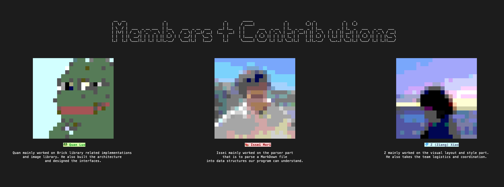

# TerminalMarkDown

This is UCSD FA22 CSE230 course project. TerminalMarkDown takes a MarkDown file from the user, and displays it in preview mode (present) in a terminal tab.

Example Usage
```stack run simple.md```

## Members



## Basic Fonts
- Emphasis (italics, bold, underline)
- Background Highlight
- Code Blocks
- Headers
- Nested Lists

## Advanced Features
- Slide Change [Markdown PowerPoint](https://sli.dev/guide/syntax.html)
- Pixelized images
- Big Headers
